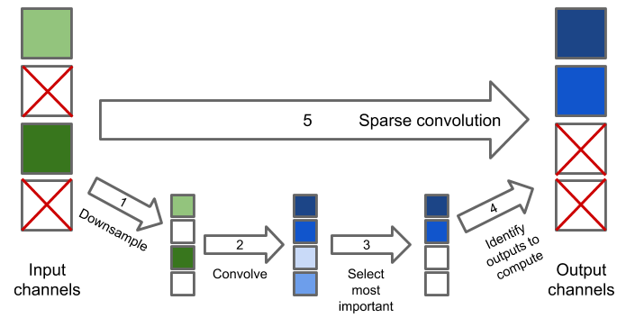

# Dynamic gating
A dynamic machine learning workload for the [Loki neural network accelerator template](https://github.com/ucam-comparch-loki/lokisim/tree/accelerator).

A simplified form of [dynamic channel pruning](https://arxiv.org/abs/1810.05331) is used, where some fraction of output channels are entirely discarded, instead of scaling all channels by a computed factor.

The workload consists of a fine-grained auxiliary computation to determine which outputs to produce, followed by a sparse convolution (from a subset of input channels to a subset of output channels):



In order to make it easier to explore different computation properties, step 4 is faked. Instead of using the result of the auxiliary computation to choose which channels to compute, a predetermined random sequence is used, making it easier to specify a percentage of channels to compute.

## Prerequisites

Compiling this code requires:
* The [Loki compiler](no_link_yet)
* [libloki](https://github.com/ucam-comparch-loki/libloki) for access to various Loki-specific features
* The [driver](https://github.com/ucam-comparch-loki/lat-ifc) for the Loki accelerator template
* The [neural network library](https://github.com/ucam-comparch-loki/lat-nn) for the Loki accelerator template

## Build

```
export LIBLOKI_DIR=path/to/libloki
export LAT_IFC_DIR=path/to/lat-ifc
export LAT_NN_DIR=path/to/lat-nn
make
```

A precompiled binary is available [here](https://gist.github.com/db434/5615c50cd22d13efb67d4db99e723df8).

## Usage

```
lokisim --cores-per-tile=2 --accelerators-per-tile=1 build/lat-dynamic in-channels in-size in-sparsity out-channels out-sparsity filter-size [mode]"
```

The program models a single layer of a convolutional neural network. The layer chooses which computation to perform, and does not compute all output channels.
* `in-channels` is the number of channels in the input.
* `in-size` is the width/height of the input in pixels.
* `in-sparsity` is the number of input channels which were computed, as a percentage.
* `out-channels` is the number of channels in the output.
* `out-sparsity` is the number of output channels to compute, as a percentage.
* `filter-size` is the width/height of the convolutional filters to apply, in pixels.
* `mode` determines how the sparsity is to be exploited:
    * `none`: do not exploit sparsity. Perform a full convolution between all inputs and all outputs.
    * `simple` (default): perform individual 2D convolutions for each pair (`input`, `output`) where `input` and `output` are single channels which have been/will be computed.
    * `adaptive`: search through the available input/output channels for sequences of consecutive computed channels, and apply convolutions to the whole sequence simultaneously. This allows better data reuse, but requires additional control code.

Running this code requires [lokisim](https://github.com/ucam-comparch-loki/lokisim/tree/accelerator) (accelerator branch).
